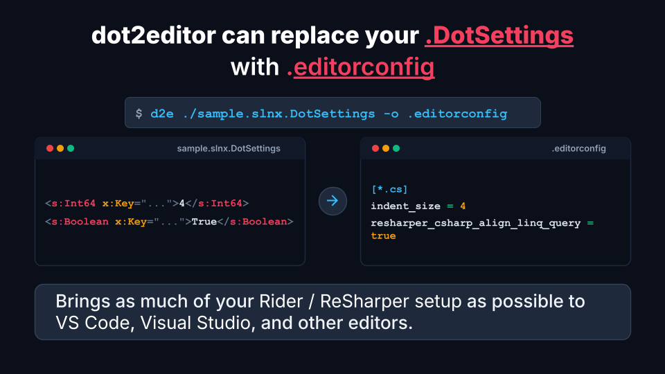

# dot2editor

**[English](README.md)** | 日本語

[](https://github.com/hanachiru/dot2editor/actions/workflows/ci.yml)
[](https://www.nuget.org/packages/Dot2Editor.Cli)
[](https://www.nuget.org/packages/Dot2Editor.Core)
[](LICENSE)



> ⚠️ **このプロジェクトは開発中であり、正常に動作しない可能性があります。**

JetBrains製品（Rider / ReSharper）の `.DotSettings` を `.editorconfig` に変換するCLIツールです。

Riderと他エディタ（VS Code、Visual Studioなど）が混在するチームでは、整形ルールを
`.DotSettings` と `.editorconfig` の二箇所で二重管理することになりがちです。
dot2editorは変換できる設定を自動で移行し、変換できなかった設定も理由付きで報告します。

## インストール

```console
$ dotnet tool install --global Dot2Editor.Cli
```

.NET 10ランタイム（以降）が必要です。

## 使い方

```console
$ d2e TeamShared.DotSettings -o .editorconfig
Merged into .editorconfig: 34 added, 1 updated, 0 already up to date.
Skipped 16 entries.
Run with --show-skipped to see what was skipped.
```

```
Usage: [arguments...] [options...] [-h|--help] [--version]

Arguments:
  [0] <string>              .DotSettingsファイルのパス。"-" で標準入力から読み込む

Options:
  -o, --output <string?>    結果の出力先。既存ファイルには追記マージし、丸ごと
                            上書きすることはない [Default: null]
  --overwrite               マージせず、出力ファイルを置き換える
  --no-root                 新規作成時に "root = true" を出力しない
  --no-header               新規作成時に生成元を示すヘッダーコメントを出力しない
  --show-skipped            変換できなかったエントリをすべて表示する
  -q, --quiet               サマリーを表示しない
```

### 既存の .editorconfig へのマージ

`--output` は既存ファイルを壊しません。コメント・空行・プロパティの並び順・
無関係なセクションや設定はそのまま保持し、dot2editorが生成するプロパティだけを
その場で更新、存在しないものは該当セクションの末尾に追記します。
2回実行しても2回目は何も変わりません（冪等）。

```ini
# Team style guide - hand maintained, do not clobber
root = true

[*.cs]
# agreed in RFC 12
indent_size = 2                              # ← 4 に更新（コメントは保持）
dotnet_diagnostic.CA1000.severity = none     # ← そのまま
                                             # ← 変換された設定はここに追記
```

本当に置き換えたい場合は `--overwrite` を指定してください。

## ライセンス

[MIT](LICENSE)
